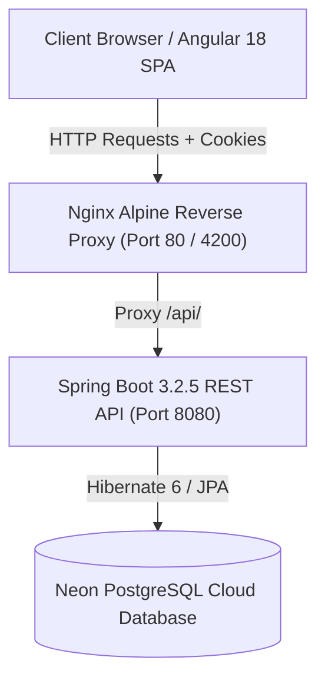
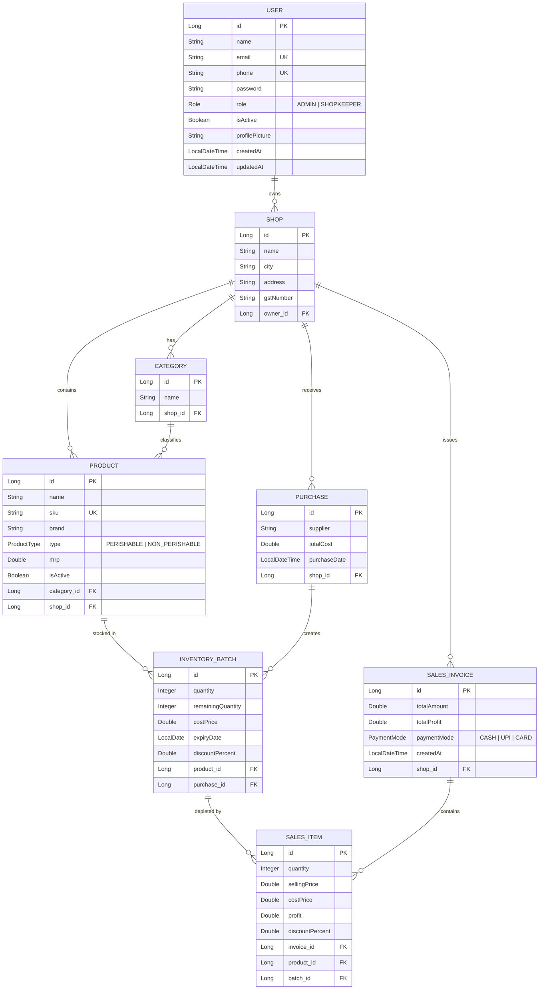
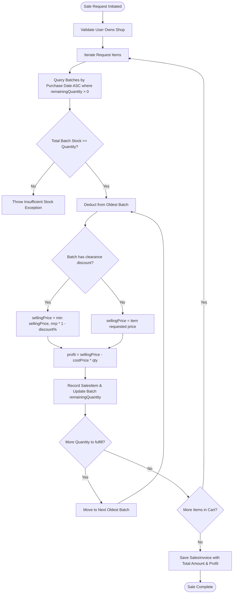

# Product Management System (PMS) — Knowledge Transfer & Technical Architecture

> **Purpose:** This document provides a complete technical and domain knowledge transfer (KT) for the **Product Management System**. It is curated so that developers and AI assistants (such as Claude) can quickly understand the system architecture, domain models, algorithms, APIs, security, and deployment pipelines.

---

## 1. Executive Summary & Vision

The **Product Management System (PMS)** is a full-stack, enterprise-grade inventory, multi-store management, Point of Sale (POS), and financial auditing application.

### Key Capabilities
- **Multi-Tenant / Multi-Shop Hierarchy:** A single user/shopkeeper can own and manage multiple retail outlets with distinct inventory, categories, and invoices.
- **Batch-Level Inventory Tracking (FIFO):** Products are not tracked as mere counters. Every purchase creates a discrete `InventoryBatch` with an individual cost price, expiry date, and quantity. Sales are deducted using **First-In, First-Out (FIFO)**.
- **Smart Recommendations Engine:** Automated mathematical models calculate sales velocity, risk scores, dynamic clearance discounts for aging/near-expiry stock, and predictive restock alerts.
- **Financial Auditing:** Real-time calculation of gross revenue, gross profit, potential financial loss from expired batches, and net profit.
- **Modern Dark Glassmorphism UI:** Built with Angular 18, utilizing CSS glassmorphism, responsive data charts (pie, bar, trendline), and custom Indian Rupee (`₹`) currency localization.
- **Stateless Cookie-Based Security:** Secure JWT authentication stored in `HttpOnly` and `SameSite` cookies with Role-Based Access Control (`ADMIN` and `SHOPKEEPER`).

---

## 2. Technology Stack Overview



| Layer | Framework / Technology | Version / Libraries | Role & Configuration |
| :--- | :--- | :--- | :--- |
| **Frontend** | Angular | 18.0.4 | Standalone components, RxJS 7.8, SSR support (`@angular/ssr`), Vanilla CSS Glassmorphism |
| **Backend** | Spring Boot | 3.2.5 (Java 17) | Spring Web, Spring Data JPA, Spring Security 6, JJWT 0.11.5, Lombok |
| **Database** | PostgreSQL | PostgreSQL 16 (Neon.tech) | Serverless cloud SQL database with SSL enabled |
| **Reverse Proxy** | Nginx | Alpine | Reverse proxy routing `/api/` to backend and serving Angular static build |
| **Containerization**| Docker & Docker Compose | Compose v2 | Multi-stage Docker builds for backend and frontend |
| **Deployment** | Render & Vercel | Production | Backend on Render.com, Frontend on Vercel, DB on Neon |

---

## 3. Database Schema & Domain Model

### 3.1 Entity Relationship Diagram



### 3.2 Key Models & Responsibilities

1. **`User.java` (`users` table):**
   - Authentication identity (`email`, `phone`, `password` encrypted with BCrypt).
   - Roles: `ADMIN` (global platform management) or `SHOPKEEPER` (store owner).
   - Contains profile avatar (`profilePicture` as base64/URL text).

2. **`Shop.java` (`shops` table):**
   - Belongs to a single `User` (`owner`).
   - Isolates categories, products, purchases, and sales invoices.

3. **`Category.java` (`categories` table):**
   - Belongs to a `Shop`. Groups related products (e.g., Dairy, Beverages, Snacks).

4. **`Product.java` (`products` table):**
   - Auto-generates unique SKU (`PRD-XXXXXXXX`) via `@PrePersist` if not supplied.
   - Categorized as `PERISHABLE` or `NON_PERISHABLE`.
   - Stores Maximum Retail Price (`mrp`).
   - Dynamic transient fields compute:
     - `availableStock`: Sum of `remainingQuantity` across active batches.
     - `expiredStock`: Sum of stock where `expiryDate <= today`.
     - `grossProfit`: Total profit generated from all completed sales items.
     - `potentialLoss`: Total cost price value of expired unsold stock.
     - `netProfit`: `grossProfit - potentialLoss`.
     - `stockStatus`: `OUT_OF_STOCK`, `EXPIRED`, `PARTIALLY_EXPIRED`, `LOW_STOCK` (<30% initial stock), or `IN_STOCK`.

5. **`Purchase.java` & `InventoryBatch.java`:**
   - Ingests stock from a supplier with timestamped purchase batches.
   - Each batch preserves its specific `costPrice`, original `quantity`, `remainingQuantity`, and `expiryDate`.
   - Supports individual batch clearance discounting (`discountPercent`).

6. **`SalesInvoice.java` & `SalesItem.java`:**
   - A POS receipt containing one or more line items (`SalesItem`).
   - Payment modes supported: `CASH`, `UPI`, `CARD`.
   - Records batch linkage to allow precise historical margin tracking.

---

## 4. Core Business Logic & Algorithms

### 4.1 First-In, First-Out (FIFO) Sales Processing (`SalesService.java`)


### 4.2 Dynamic Risk Scoring & Heuristic Discount Engine (`RecommendationController.java`)
The system analyzes perishable and slow-moving batches to suggest clearance discounts before expiry:

$$\text{Risk Score} = (0.40 \times \text{ExpiryUrgency}) + (0.25 \times \text{StockPressure}) + (0.20 \times \text{LowDemand}) + (0.15 \times \text{WasteHistory})$$

#### Factor Definitions:
1. **Expiry Urgency ($0 - 100$):**
   - If $\text{daysLeft} \le 0 \implies 100.0$ (Expired)
   - If $\text{daysLeft} > 30 \implies 0.0$
   - Otherwise $\implies 100.0 - (\text{daysLeft} \times \frac{100}{30})$
2. **Stock Pressure ($0 - 100$):**
   - Ratio between current stock and daily sales velocity. $\ge 45\text{ days of stock} \implies 100.0$.
3. **Low Demand Factor ($0 - 100$):**
   - Deficit against target benchmark velocity ($5.0\text{ units/day}$).
4. **Waste History Factor ($0 - 100$):**
   - Number of previously expired, unsold batches for this product ($\ge 3 \implies 100.0$).

#### Recommended Discount Percentage Formula:
$$\text{Discount} = \text{clamp}\left(5\%, 80\%, 10\% + (\text{ExpiryFactor}) + (\text{OverstockFactor}) - (\text{DemandStrength})\right)$$

### 4.3 Restock Urgency Algorithm (`RecommendationController.java`)
- **Daily Sales Velocity:** Calculated dynamically or simulated per product ID.
- **Estimated Stock Lifetime:** $\text{Days Left} = \frac{\text{Available Stock}}{\text{Sales Velocity}}$
- **Classification:**
  - **HIGH URGENCY:** Stock $= 0$ (Out of stock) OR $\text{Days Left} \le 3$ days.
  - **MEDIUM URGENCY:** $\text{Days Left} \le 7$ days.
  - **LOW URGENCY:** Current stock is flagged by inventory threshold rules ($<30\%$).

---

## 5. Security & Authentication Architecture

### 5.1 Cookie-Based Stateless JWT Pipeline
- **Dual-Cookie Design:**
  1. `jwt-token` (HttpOnly): Contains signed JWT token with email subject, issued date, and 24-hour expiration. Inaccessible to client JavaScript for XSS defense.
  2. `user-info` (Non-HttpOnly): URL-encoded string `Name:Role` accessible by Angular for instant client-side rendering and navbar state.
- **Spring Security Configuration (`SecurityConfig.java`):**
  - Session Creation: `STATELESS`.
  - CSRF: Disabled for REST API.
  - CORS: Configured with `allowCredentials(true)` and origin patterns for `localhost:*` and `*.vercel.app`.
  - Filter: `JwtAuthenticationFilter` executes before `UsernamePasswordAuthenticationFilter`.

### 5.2 Role-Based Access Control (RBAC) Matrix
| Resource / Action | ADMIN | SHOPKEEPER | Public / Guest |
| :--- | :---: | :---: | :---: |
| Register / Login / Forgot Password | Allowed | Allowed | Allowed |
| View Dashboard & Smart Insights | Allowed | Allowed | Denied |
| Manage Products / Categories / Shops | Allowed | Allowed | Denied |
| Record Purchases & Inventory Ingestion | Allowed | Allowed | Denied |
| Create Sales & View POS History | Allowed | Allowed | Denied |
| Manage Users / Activate / Deactivate Accounts | Allowed | Denied | Denied |
| Create Admin Accounts | Allowed | Denied | Denied |

---

## 6. Complete REST API Reference

### 6.1 Authentication (`/api/auth`)
- `POST /api/auth/register` — Register a standard `SHOPKEEPER` account.
- `POST /api/auth/register-admin` — Register an `ADMIN` account.
- `POST /api/auth/login` — Authenticate via email or phone + password; sets authentication cookies.
- `POST /api/auth/logout` — Invalidate session and clear cookies.
- `POST /api/auth/forgot-password` — Password reset by matching email and verified phone number.

### 6.2 Products & Inventory (`/api/products`)
- `GET /api/products` — Retrieve all products owned by current user's shops.
- `POST /api/products` — Create a new product under a shop & category.
- `PUT /api/products/{id}` — Update product name, brand, SKU, type, or active state.
- `DELETE /api/products/{id}` — Delete a product.
- `GET /api/products/report` — Detailed inventory batch report with query filters (`startDate`, `endDate`, `status`).
- `POST /api/products/{id}/apply-discount?discountPercent={val}` — Apply product-level discount to MRP.
- `POST /api/products/batch/{batchId}/apply-discount?discountPercent={val}` — Apply clearance discount to a specific batch.
- `POST /api/products/{id}/clear-expired` — Zero-out remaining quantity of expired batches.
- `GET /api/products/category/{categoryId}` — Fetch products by category ID.

### 6.3 Recommendations & Stock Health (`/api/recommendations`)
- `GET /api/recommendations/summary` — Returns `StockHealthSummaryDTO` (total potential loss, recoverable amount, high-risk items, health score).
- `GET /api/recommendations/restock` — Returns list of products needing restock with urgency and reasons.
- `GET /api/recommendations/discounts` — Returns batch-level clearance discount recommendations and risk scores.

### 6.4 Purchases (`/api/purchases`)
- `GET /api/purchases` — List all purchase transactions with itemized batch details.
- `POST /api/purchases` — Record a new purchase from supplier and instantiate new `InventoryBatch` records.

### 6.5 Sales (`/api/sales`)
- `GET /api/sales` — Fetch full sales invoices history.
- `POST /api/sales/create` — Process a new cart checkout with FIFO deduction.

### 6.6 Shops & Categories (`/api/shops`, `/api/categories`)
- `GET /api/shops` — List shops owned by user.
- `POST /api/shops` — Create a new shop.
- `GET /api/categories` — List all categories.
- `POST /api/categories` — Create category for a specific shop.
- `PUT /api/categories/{id}` — Update category name.
- `DELETE /api/categories/{id}` — Delete category.

### 6.7 User Management & System Diagnostics (`/api/users`, `/api/system`)
- `GET /api/users` — [ADMIN] List all system users.
- `GET /api/users/me` — Get profile of authenticated user.
- `PUT /api/users/me` — Update current user profile, password, or base64 avatar.
- `PUT /api/users/{id}/status?active={bool}` — [ADMIN] Toggle user account status.
- `POST /api/users/admin` — [ADMIN] Create a new administrator.
- `DELETE /api/users/{id}` — [ADMIN] Permanently delete a user account.
- `GET /api/system/status` — Live system health check (database connection check, JVM memory usage in MB, system uptime in seconds).

---

## 7. Frontend Architecture & Design System

### 7.1 Angular Component & Route Tree
```
product-management-system-frontend/src/app/
├── guards/
│   ├── auth.guard.ts           # Protects /dashboard routes, checks role permissions
│   └── guest.guard.ts          # Redirects logged-in users away from /login & /register
├── pipes/
│   └── inr.pipe.ts             # Custom Indian Rupee currency pipe (₹ format)
├── services/
│   ├── auth.service.ts         # Login, logout, session state & cookie decoding
│   ├── product.service.ts      # Product CRUD, reports, and recommendations
│   ├── sales.service.ts        # POS cart checkout and invoice history
│   ├── purchase.service.ts     # Supplier purchase orders and batch creation
│   ├── shop.service.ts         # Shop management
│   ├── category.service.ts     # Category management
│   ├── user.service.ts         # User profiles and Admin user management
│   └── status.service.ts       # 30-second polling for live backend health status
└── pages/
    ├── login/                  # User login (email or phone)
    ├── register/               # Shopkeeper onboarding
    ├── forgot-password/        # Verified phone password reset
    ├── dashboard/              # Master layout container with collapsible sidebar
    │   ├── home/               # Metric cards, Onboarding setup steps, Live health pill
    │   ├── products/           # Product CRUD with search & category filtering
    │   ├── product-catalog/    # Grid view catalog with stock status badges
    │   ├── shops/              # Store management
    │   ├── categories/         # Category management
    │   ├── purchases/          # Stock intake form & purchase history
    │   ├── inventory-report/   # Batch-level audit, expiry days-left badge, loss audit
    │   ├── profit-report/      # Gross/Net profit breakdown, top-10 products bar chart, category pie
    │   ├── sales/              # Interactive POS billing terminal & sales trends
    │   ├── restock/            # Predictive restock priority list
    │   ├── insights/           # Real-time discount engine & 1-click batch clearance
    │   ├── user-management/    # Admin user control & status toggle
    │   └── profile/            # Avatar upload, user details, password change
```

### 7.2 Design Tokens & Theme (`styles.css`)
- **Theme:** Ultra-Modern Dark Glassmorphism.
- **Glass Effect:** `backdrop-filter: blur(12px)` over translucent background `rgba(30, 41, 59, 0.7)` with subtle borders `rgba(255, 255, 255, 0.08)`.
- **Colors:**
  - Primary: `#6366f1` (Indigo)
  - Secondary: `#ec4899` (Pink)
  - Accent: `#22d3ee` (Cyan)
  - Success: `#10b981` (Emerald)
  - Warning: `#f59e0b` (Amber)
  - Danger: `#ef4444` (Crimson)
- **Charts:** Lightweight, pure CSS implementations using CSS variables, custom bar graphs, and dynamic `conic-gradient()` pie charts.

---

## 8. Deployment, Containerization & Operations

### 8.1 Docker Compose Orchestration (`docker-compose.yml`)
```yaml
services:
  backend:
    build:
      context: ./product-management-system-backend
      dockerfile: Dockerfile
    container_name: product-management-backend
    ports:
      - "8080:8080"
    environment:
      - SPRING_DATASOURCE_URL=jdbc:postgresql://<neon-host>/neondb?sslmode=require
      - SPRING_DATASOURCE_USERNAME=neondb_owner
      - SPRING_DATASOURCE_PASSWORD=<password>
      - CORS_ALLOWED_ORIGINS=http://localhost:4200,http://localhost,http://localhost:80
      - JWT_COOKIE_SECURE=false
      - JWT_COOKIE_SAME_SITE=Lax
    restart: unless-stopped

  frontend:
    build:
      context: ./product-management-system-frontend
      dockerfile: Dockerfile
      args:
        - API_URL=http://localhost:8080/api
    container_name: product-management-frontend
    ports:
      - "4200:80"
    depends_on:
      - backend
    restart: unless-stopped
```

### 8.2 Production Deployment Setup
1. **Database:** Hosted on **Neon Serverless PostgreSQL** with SSL encryption (`sslmode=require`).
2. **Backend:** Deployed on **Render.com** via Docker environment using `render.yaml`.
3. **Frontend:** Deployed on **Vercel** with build-time environment injection via `set-env.js`.
4. **Nginx Reverse Proxy:** In containerized deployments, Nginx routes requests matching `/api/` to `http://backend:8080/api/` and serves Angular static assets for all other routes.

---

## 9. Quick Onboarding Guide for Developers & Claude

When modifying or extending this codebase, follow these established patterns:

1. **Adding a New Product Field:**
   - Update `Product.java` entity, run Maven build.
   - Update `Product` interface in `product.service.ts`.
   - Update `products.component.html` (form modal and table view).

2. **Modifying Inventory Calculation:**
   - All stock quantities MUST be computed from `InventoryBatch.java` (`remainingQuantity`).
   - Never decrement product-level integers directly; all stock transactions MUST go through `InventoryBatchRepository`.

3. **Modifying Security / Cookie Behavior:**
   - For local development: `JWT_COOKIE_SECURE=false`, `JWT_COOKIE_SAME_SITE=Lax`.
   - For production (cross-origin Render + Vercel): `JWT_COOKIE_SECURE=true`, `JWT_COOKIE_SAME_SITE=None`.

4. **Running Automated Verification:**
   - Backend tests: `mvn clean test` in `product-management-system-backend`.
   - Frontend tests: `npm test` or `ng build` in `product-management-system-frontend`.
