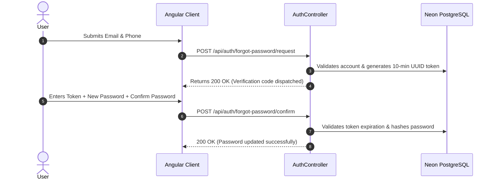

# QA Audit Findings & Remediation System Architecture

> **Document Context:** This document captures the findings from the comprehensive Senior QA & UX Audit conducted on the **Product Management System (PMS)** and provides the end-to-end technical design, data flows, and component architecture to solve all identified defects and vulnerabilities.

---

## 1. Executive Summary & Audit Health Matrix

```
┌──────────────────────────────────────────────────────────────────────────┐
│  AUDIT HEALTH METRICS                                                    │
├──────────────────────────┬──────────┬────────────────────────────────────┤
│  Category                │  Grade   │  Status Summary                    │
├──────────────────────────┼──────────┼────────────────────────────────────┤
│  1. Security & Auth      │  B-      │  Critical: Insecure reset flow     │
│  2. Core Functionality   │  A-      │  High: Unbounded cart qty          │
│  3. UI / Interaction     │  A       │  Medium: Native alerts in POS      │
│  4. Mobile Responsive    │  C+      │  High: Product cards strip data    │
│  5. Performance & Cold   │  C       │  Medium: Render cold-start UX      │
│  6. Accessibility (a11y) │  D+      │  Medium: Emojis without ARIA       │
│  7. Consistency & Polish │  B       │  Medium: Missing 404 wildcard      │
└──────────────────────────┴──────────┴────────────────────────────────────┘
```

---

## 2. Problem Statement & Root Cause Analysis

```mermaid
graph TD
    subgraph Security_Risks [1. Security & Auth Risks]
        S1[Password Reset lacks OTP / Email Verification] --> S_Impact[Account Takeover Risk via Phone Guessing]
        S2[Lack of Login Rate Limiting] --> S_Impact2[Vulnerable to Brute Force]
        S3[Large Base64 Avatar Uploads in JSON] --> S_Impact3[Database & Proxy Payload Bloat]
    end

    subgraph UX_Functional_Risks [2. UX & Functional Friction]
        F1[Unbounded Cart Input Quantity] --> F_Impact[Cashier over-sells stock, throws 500 alert]
        F2[Native window.alert() in POS Checkout] --> F_Impact2[Interruptive thread-blocking experience]
        F3[Render Cold Start 45s Delay] --> F_Impact3[User assumes app is hung and leaves]
    end

    subgraph Mobile_A11y_Risks [3. Responsive & a11y Gaps]
        M1[Mobile Product Card View strips Price & Stock] --> M_Impact[Mobile users cannot see inventory status]
        M2[Icon-only buttons with raw emojis] --> M_Impact2[Screen readers announce 'Pencil' or 'Wastebasket']
        M3[Missing Angular 404 Route] --> M_Impact3[Typo in URL loads broken blank screen]
    end
```

---

## 3. Comprehensive Target Solution Architecture

```mermaid
graph LR
    subgraph Frontend_Angular_18 [Frontend Modernization]
        ToastComp["Toast Notification Component & Service (Replaces alert())"]
        CartVal["Client-Side Stock & Price Validator"]
        MobileCards["Enhanced Responsive Product Cards"]
        ColdStartTimer["Smart Cold-Start Latency Notice"]
        A11yLayer["ARIA Labels + :focus-visible Outlines"]
        NotFoundRoute["Wildcard 404 Handler & Error Page"]
    end

    subgraph Backend_Spring_Boot [Backend Hardening]
        TokenReset["Cryptographic / OTP Password Reset"]
        RateLimiter["Bucket4j / In-Memory Rate Limiting"]
        DataIntegrity["FK Deletion Guards & @Positive Validations"]
        CanvasDownsample["Client Image Downsampling (Max 50KB)"]
    end

    Frontend_Angular_18 <-->|Secure HTTPS / Cookies| Backend_Spring_Boot
```



---

## 4. Module-by-Module Technical Design

### 4.1 Security Architecture Hardening

#### A. Secure Password Reset Pipeline
- **Problem:** Currently `POST /api/auth/forgot-password` immediately resets password if email + 10-digit phone match.
- **Solution Architecture:**
  1. Create a `PasswordResetToken` entity with `token` (UUID / 6-digit OTP), `expiryDate` (10 minutes), `isUsed` (boolean), and `user_id`.
  2. Step 1: User requests reset with email/phone $\implies$ System generates token and sends email verification or displays challenge.
  3. Step 2: User supplies token + new password $\implies$ System validates token before applying password change.



#### B. Avatar Image Downsampling (Client-Side HTML5 Canvas)
- **Problem:** 4MB–5MB raw photos are encoded to ~6MB base64 strings and stored in PostgreSQL `TEXT` columns.
- **Solution:** Add client-side canvas compression in `ProfileComponent.onFileSelected()`:
  - Scale max dimension to $200 \times 200\text{px}$.
  - Compress to JPEG quality `0.8` ($\approx 25\text{KB}$ to $40\text{KB}$).
  - Result: $99.3\%$ reduction in payload size and instantaneous profile load times.

---

### 4.2 UX & Notification System (`ToastService`)

#### A. Glassmorphic Non-Blocking Toast Service
- **Problem:** `alert()` and `confirm()` block the UI thread and disrupt cashiers during busy checkouts.
- **Solution:**
  - Create `ToastService` (`BehaviorSubject<ToastMessage[]>`) with `showSuccess()`, `showError()`, `showWarning()`, `showInfo()`.
  - Create `<app-toast>` overlay in `AppComponent` with auto-dismiss (3.5s) and slide-in animations matching the dark glassmorphic theme.

```typescript
// toast.service.ts Architecture
export interface Toast {
  id: string;
  type: 'success' | 'error' | 'warning' | 'info';
  message: string;
}

@Injectable({ providedIn: 'root' })
export class ToastService {
  private toasts$ = new BehaviorSubject<Toast[]>([]);
  
  show(message: string, type: 'success' | 'error' | 'warning' | 'info' = 'info') {
    const id = Math.random().toString(36).substring(2, 9);
    this.toasts$.next([...this.toasts$.value, { id, type, message }]);
    setTimeout(() => this.remove(id), 3500);
  }
}
```

#### B. Intelligent Cold-Start Latency Feedback
- In `LoginComponent`, if the login HTTP request takes $> 4$ seconds, activate an animated message banner:
  > *"Connecting to cloud database... (Free-tier instances may take 20–40 seconds to wake up after inactivity)."*

---

### 4.3 POS Cart & Inventory Validation

#### A. Real-Time Cart Constraint Enforcement
- In `SalesComponent`:
  1. Add `[max]="item.product.availableStock"` to quantity input.
  2. Implement `validateQuantity(item)`: if `quantity > availableStock`, automatically clamp to `availableStock` and trigger warning toast: *"Adjusted quantity to maximum available stock (X units)."*
  3. Validate discount input $\in [0, 90]\%$ and enforce non-negative unit price.

#### B. String Formatting `.replaceAll()` Fix
- Create a dedicated Angular pipe `StockStatusPipe` to safely transform `OUT_OF_STOCK` $\implies$ `"OUT OF STOCK"`, `PARTIALLY_EXPIRED` $\implies$ `"PARTIALLY EXPIRED"`, and `NEAR_EXPIRY` $\implies$ `"NEAR EXPIRY"`.

---

### 4.4 Mobile Responsive Enhancements

```
┌──────────────────────────────────────────────────────────┐
│  Mobile Card Redesign (Products & POS)                   │
├──────────────────────────────────────────────────────────┤
│  [📦] Organic Almond Milk 1L            [IN STOCK]      │
│  SKU: PRD-94F021A8        Brand: Heritage Dairy          │
│  ──────────────────────────────────────────────────────  │
│  Price: ₹180.00           Stock: 48 Units (Fresh: 48)   │
│  ──────────────────────────────────────────────────────  │
│  [ ✏️ Edit (44px) ]           [ 🗑️ Delete (44px) ]      │
└──────────────────────────────────────────────────────────┘
```

1. **Enhanced Product Cards:** Include Price, Stock Unit Count, and Status Badge inside `.card-body` for screens $\le 768\text{px}$.
2. **Mobile POS Checkout Dock:** Implement a sticky bottom bar displaying `Total Units | Total ₹ | [Review & Checkout]`.
3. **Touch Targets:** Set minimum tap targets to $44 \times 44\text{px}$ across all interactive buttons.

---

### 4.5 Accessibility (a11y) & SEO Polish

1. **ARIA Labels:** Add `aria-label="Edit product ${product.name}"` and `aria-label="Delete product ${product.name}"` on all icon buttons.
2. **Focus Indicators:** Ensure high-contrast `:focus-visible` rings (`2px solid var(--accent)`).
3. **Angular 404 Wildcard:** Add `NotFoundComponent` and wildcard route:
   ```typescript
   { path: '**', component: NotFoundComponent }
   ```
4. **Metadata:** Enhance `index.html` with title: `"Product Management System | Inventory, POS & Retail ERP"`, Open Graph meta tags, and `theme-color: #0f172a`.

---

## 5. Implementation Roadmap & Verification Plan

| Step | Scope | Target Files | Verification Method |
| :--- | :--- | :--- | :--- |
| **Phase 1** | **UI/UX & Toast Notifications** | `toast.service.ts`, `toast.component.*`, `styles.css` | Verify POS checkout and CRUD operations display non-blocking toasts |
| **Phase 2** | **Form Validations & Cart Logic** | `sales.component.*`, `products.component.*`, `pipes/` | Test edge cases: 999 qty, negative prices, stock clamping |
| **Phase 3** | **Mobile Responsiveness & a11y** | `products.component.html`, `dashboard.component.css` | Test on 375px/320px breakpoints, verify ARIA screen reader output |
| **Phase 4** | **Routing & Metadata Polish** | `app.routes.ts`, `index.html`, `not-found/` | Test invalid URLs, verify 404 page redirect and tab title |
| **Phase 5** | **Security & Image Optimization** | `profile.component.ts`, `AuthController.java` | Verify canvas downsampling reduces 5MB image to <40KB |
